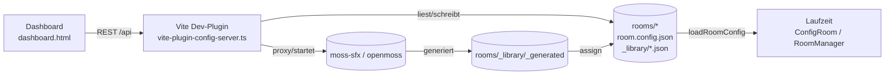

# Konfigurations-Dashboard

Datengetriebenes Dashboard, mit dem sich die Resonanz-Raeume sowie die von allen
Raeumen gemeinsam genutzten Medien, Effekte und Interaktionen konfigurieren
lassen. Es schreibt direkt in das Repository (`rooms/<id>/room.config.json` und
`rooms/_library/*.json`) und ist **nur im Dev-Modus** aktiv.

## Aufruf

```powershell
cd app
npm run dev
```

- Laufzeit-Raum (wie bisher): http://localhost:5173/
- Dashboard: http://localhost:5173/dashboard.html

## Architektur



- **Datenmodell:** `app/src/config/types.ts` (`RoomConfig`) und
  `app/src/config/libraryTypes.ts` (Bibliotheken + General-Settings).
- **Quelle der Wahrheit:** `rooms/<id>/room.config.json` (validiert gegen
  `rooms/_schema/room.config.schema.json`).
- **Gemeinsame Bibliotheken:** `rooms/_library/effects.json`,
  `interactions.json`, `silhouettes.json`, `general.json`.
- **Generierter Audio-Pool:** `rooms/_library/_generated/` plus
  `rooms/_library/generated.json` fuer Wiederverwendung und Preview.
- **Laufzeit:** `RoomManager` laedt die Config per `loadRoomConfig()` und reicht
  sie an `ConfigRoom` weiter; die Raum-Config referenziert weiterhin normale
  relative Pfade wie `audio/<datei>.ogg` oder `audio/<datei>.wav`.

## Tabs

### Raum-Einstellungen (ROOM SETTINGS)
Pro Raum: Hintergrund (+ Upload), Ambiente-Klaenge (mehrere Ebenen mit
Lautstaerke/Fade), visuelle Effekt-Loops (Typ + Intensitaet, an/aus),
interaktive Elemente aus der Bibliothek (Zone-Zuordnung),
Zonen-/Perspektiven-Editor (Canvas, Klick-/Drop-Zonen als Polygone +
Fluchtperspektive VP/RP), Praesenzen (Arten, Gewichte, Hoehen),
Zufallsereignisse, Intro (Sound + Text), Sprecher (Audio + Begleittext),
minimale Verweildauer + Portal-Hinweis.

Neu: Fuer Ambient-Slots, Sound-Random-Events, Intro und Sprecher koennen jetzt
Generator-Modals geoeffnet werden.

### Allgemein & Bibliotheken (GENERAL SETTINGS)
Uebergangs-Defaults (Dauer/Min/Max/Portal), Silhouetten-Standards, Anzeige der
Effekt-/Interaktions-/Silhouetten-Bibliothek sowie das
**KI-Scaffold-Formular**.

## KI-Audio: SFX & TTS

Das Dashboard kann pro Raum Audio direkt generieren:

- **SFX / Hintergrundgeraeusche** ueber `moss-sfx`
- **TTS / gesprochene Texte** ueber `openmoss`

Im Header zeigt das Dashboard den Status beider Dienste an und kann sie direkt
starten. In den Raum-Einstellungen oeffnen **"SFX generieren"** bzw.
**"TTS generieren"** ein Modal mit:

- Eingabefeld fuer Szene/Prompt oder Text
- Preview bereits generierter Takes
- Retry mit neuem Seed
- Uebernahme eines ausgewaehlten Takes in den aktuellen Raum

Generierte Dateien landen zunaechst im globalen Pool
`rooms/_library/_generated/`; Metadaten und Request-Parameter werden in
`rooms/_library/generated.json` gespeichert. Erst bei **"Fuer diesen Raum
verwenden"** wird die Datei nach `rooms/<id>/audio/` kopiert und in `meta.json`
mit Provenienz eingetragen. Dadurch koennen bereits erzeugte Sounds und Stimmen
raumuebergreifend wiederverwendet werden.

## KI-gestuetztes Hinzufuegen

Das Scaffold-Formular erzeugt unter `tools/recipes/` zwei Dateien:

- `<name>.spec.json` - strukturierte Spezifikation (Typ, Name, Beschreibung, Parameter)
- `<name>.agent-prompt.md` - Auftrag fuer einen Coding-Agenten inkl. Implementierungsvertrag

Ein Agent implementiert daraus die TS-Klasse (`app/src/effects/` bzw. Handler),
registriert sie in `app/src/effects/registry.ts` / `interactions/registry.ts`
und setzt den Bibliothekseintrag auf `source: "builtin"`.

## REST-API (nur Dev)

| Methode | Pfad | Zweck |
| --- | --- | --- |
| GET | `/api/services/status` | Status von `moss-sfx` und `openmoss` |
| POST | `/api/services/start` | Lokalen Dienst starten (`sfx` oder `tts`) |
| GET | `/api/rooms` | Raumliste |
| POST | `/api/rooms` | Neuen Raum anlegen (Ordner + Default-`room.config.json`) |
| GET/PUT | `/api/rooms/:id/config` | Raumkonfiguration lesen/schreiben |
| GET | `/api/rooms/:id/assets` | Asset-Dateien (Hintergrund/Audio/Artefakte/Anker) |
| POST | `/api/rooms/:id/assets` | Asset hochladen (+ `meta.json`-Provenienz) |
| POST | `/api/rooms/:id/generate/sfx` | SFX via `moss-sfx` erzeugen |
| POST | `/api/rooms/:id/generate/tts` | Sprache via `openmoss` erzeugen |
| GET | `/api/generated` | Globalen Katalog generierter Takes lesen |
| GET | `/api/generated/:gid/file` | Pool-Datei fuer Preview streamen |
| POST | `/api/rooms/:id/generated/:gid/assign` | Generierten Take nach `rooms/<id>/audio/` uebernehmen |
| GET/PUT | `/api/library/:kind` | Bibliothek lesen/schreiben (`effects`/`interactions`/`silhouettes`/`general`) |
| POST | `/api/scaffold` | Scaffold-Spec + Agent-Prompt erzeugen |

Alle Pfadsegmente und Dateinamen werden streng saniert (kein
Directory-Traversal).

## Dienst-Konfiguration

Lokale Defaults fuer die Generatoren liegen in `app/.env.example`:

- `MOSS_SFX_DIR=F:/code/moss-sfx`
- `MOSS_SFX_URL=http://127.0.0.1:8765`
- `OPENMOSS_DIR=F:/code/openmoss`
- `OPENMOSS_URL=http://127.0.0.1:8080`

Die Dev-API nutzt diese Werte fuer Health-Checks, Start-Skripte und Proxying.

## Neue Raeume & automatische Default-Config

Raeume ohne `room.config.json` (z. B. `hoeren`, `vorhof`) liefern beim Lesen
ueber `GET /api/rooms/:id/config` **keinen 404 mehr**, sondern eine generierte
Default-Konfiguration: Der vorhandene Hintergrund wird erkannt
(`background*.{png,jpg,webp}`), Ambiente/Effekte/Interaktionen/Zonen sind leer,
Praesenz und Intro sind deaktiviert. So ist jeder Raum im Dashboard sofort
bearbeitbar; erst beim Speichern (`PUT`) entsteht die Datei.

Ueber **"+ Neuer Raum"** in der Toolbar (bzw. `POST /api/rooms`) legt das
Dashboard einen neuen Raumordner samt `audio/`- und `artifacts/`-Verzeichnis und
Default-Config an. Die Raum-ID wird gegen `^[a-z0-9][a-z0-9_-]*$` validiert;
existierende Raeume werden mit `409` abgewiesen.

## Zufallsereignisse zur Laufzeit

In `room.config.json` definierte `randomEvents` werden im `ConfigRoom` zur
Laufzeit ausgeloest. Beim Aktivieren des Raums plant `startRandomEvents()` fuer
jedes aktivierte Ereignis einen Timer im Intervall `[minIntervalMs,
maxIntervalMs]`; nach jedem Ausloesen wird neu geplant. `kind: "sound"` spielt
`ref` als One-Shot ueber die `AudioEngine`; Timer werden in `destroy()` sauber
abgeraeumt. Ereignisse mit `enabled: false` werden uebersprungen.

## Zonen-Editor: naechstgelegener Pfad

Beim Klick in leeren Raum fuegt der Editor den Punkt nicht mehr stur dem zuerst
angelegten Polygon hinzu, sondern dem Polygon mit dem **naechstgelegenen
Stuetzpunkt** zum Klick (`nearestPolygonIndex`). Ein noch leeres aktives Polygon
wird zuerst weitergebaut, damit neue Pfade gezielt entstehen koennen.

## Sind Interaktions-/Effekt-Scripts raumgebunden?

Nein - die Implementierungen sind **global**. Effekte und Interaktionen werden
einmalig in den modulweiten Registries `app/src/effects/registry.ts` bzw.
`app/src/interactions/registry.ts` registriert und ueber eine ID adressiert. Ein
Raum referenziert sie nur in seiner `room.config.json`
(`interactions[].interaction = "<id>"` bzw. `effects[].type = "<id>"`) und
verknuepft sie mit seinen eigenen Zonen.

Beispiel: Eine einmal implementierte Interaktion `zettel` (Zettel an Pinnwand)
steht damit **jedem** Raum zur Verfuegung - der naechste Raum bindet sie
schlicht ueber seine Config ein und legt eigene Zonen fest. Raumspezifisch sind
nur die Konfiguration (welche Scripts, welche Zonen, welche Assets), nicht der
Code.