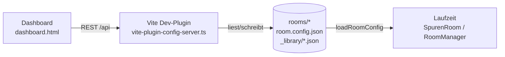

# Konfigurations-Dashboard

Datengetriebenes Dashboard, mit dem sich die Resonanz-Räume sowie die von allen
Räumen gemeinsam genutzten Medien, Effekte und Interaktionen konfigurieren lassen.
Es schreibt direkt in das Repository (`rooms/<id>/room.config.json` und
`rooms/_library/*.json`) und ist **nur im Dev-Modus** aktiv.

## Aufruf

```powershell
cd app
npm run dev
```

- Laufzeit-Raum (wie bisher): http://localhost:5173/
- Dashboard: http://localhost:5173/dashboard.html

## Architektur



- **Datenmodell:** `app/src/config/types.ts` (`RoomConfig`) und
  `app/src/config/libraryTypes.ts` (Bibliotheken + General-Settings).
- **Quelle der Wahrheit:** `rooms/<id>/room.config.json` (validiert gegen
  `rooms/_schema/room.config.schema.json`).
- **Gemeinsame Bibliotheken:** `rooms/_library/effects.json`,
  `interactions.json`, `silhouettes.json`, `general.json`.
- **Laufzeit:** `RoomManager` lädt die Config per `loadRoomConfig()` und reicht
  sie an `SpurenRoom` weiter; alle bisher hartcodierten Werte (Hintergrund,
  Ambient, Effekte, Zonen, Perspektive, Intro, Präsenzen, Verweildauer) kommen
  jetzt aus der Config.

## Tabs

### Raum-Einstellungen (ROOM SETTINGS)
Pro Raum: Hintergrund (+ Upload), Ambiente-Klänge (mehrere Ebenen mit
Lautstärke/Fade), visuelle Effekt-Loops (Typ + Intensität, an/aus), interaktive
Elemente aus der Bibliothek (Zone-Zuordnung), Zonen-/Perspektiven-Editor
(Canvas, Klick-/Drop-Zonen als Polygone + Fluchtperspektive VP/RP), Präsenzen
(Arten, Gewichte, Höhen), Zufallsereignisse, Intro (Sound + Text), Sprecher
(mp3 + Begleittext), minimale Verweildauer + Portal-Hinweis.

### Allgemein & Bibliotheken (GENERAL SETTINGS)
Übergangs-Defaults (Dauer/Min/Max/Portal), Silhouetten-Standards, Anzeige der
Effekt-/Interaktions-/Silhouetten-Bibliothek sowie das **KI-Scaffold-Formular**.

## KI-gestütztes Hinzufügen

Das Scaffold-Formular erzeugt unter `tools/recipes/` zwei Dateien:

- `<name>.spec.json` — strukturierte Spezifikation (Typ, Name, Beschreibung, Parameter)
- `<name>.agent-prompt.md` — Auftrag für einen Coding-Agenten inkl. Implementierungsvertrag

Ein Agent implementiert daraus die TS-Klasse (`app/src/effects/` bzw. Handler),
registriert sie in `app/src/effects/registry.ts` / `interactions/registry.ts`
und setzt den Bibliothekseintrag auf `source: "builtin"`.

## REST-API (nur Dev)

| Methode | Pfad | Zweck |
| --- | --- | --- |
| GET | `/api/rooms` | Raumliste |
| GET/PUT | `/api/rooms/:id/config` | Raumkonfiguration lesen/schreiben |
| GET | `/api/rooms/:id/assets` | Asset-Dateien (Hintergrund/Audio/Artefakte/Anker) |
| POST | `/api/rooms/:id/assets` | Asset hochladen (+ `meta.json`-Provenienz) |
| GET/PUT | `/api/library/:kind` | Bibliothek lesen/schreiben (`effects`/`interactions`/`silhouettes`/`general`) |
| POST | `/api/scaffold` | Scaffold-Spec + Agent-Prompt erzeugen |

Alle Pfadsegmente und Dateinamen werden streng saniert (kein Directory-Traversal).
